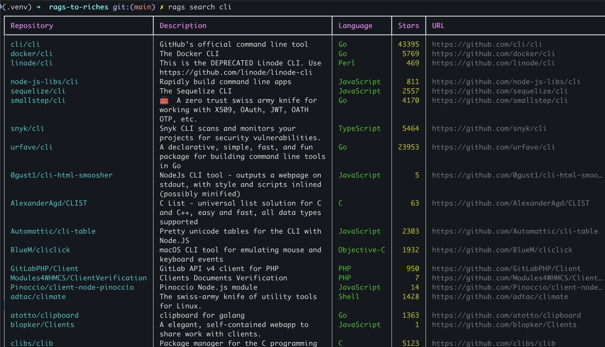

# rags-to-riches

A CLI for searching your GitHub starred repositories.



## Installation

```bash
uv venv .venv && uv pip install -e .
source .venv/bin/activate
```

## Auth

Set your GitHub token:

```bash
export GITHUB_TOKEN=ghp_...
```

Or install the [gh CLI](https://cli.github.com/) and run `gh auth login`.

## Usage

```bash
rags search <query>       # search by name, description, topic, or language
rags search <query> -n 5  # limit results
rags search <query> -o    # open top result in browser
rags search <query> -r    # refresh cache before searching
rags refresh              # force refresh the local cache
```

Stars are cached at `~/.cache/rags-to-riches/stars.json` for 1 hour.
