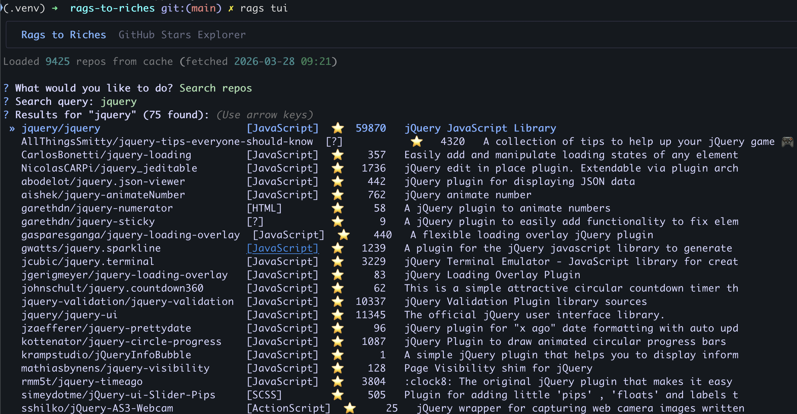
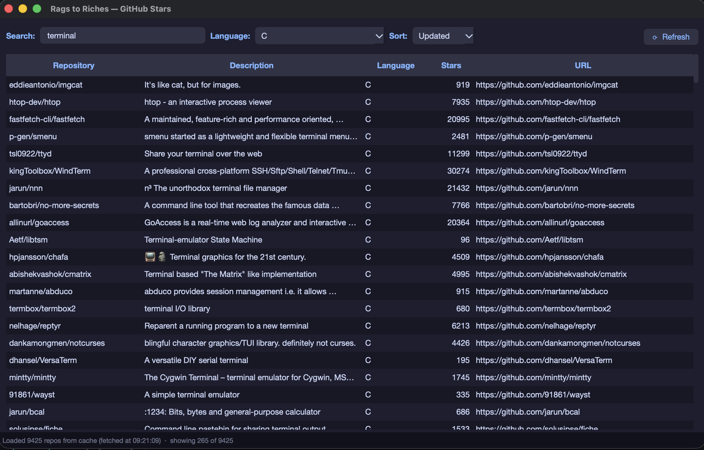
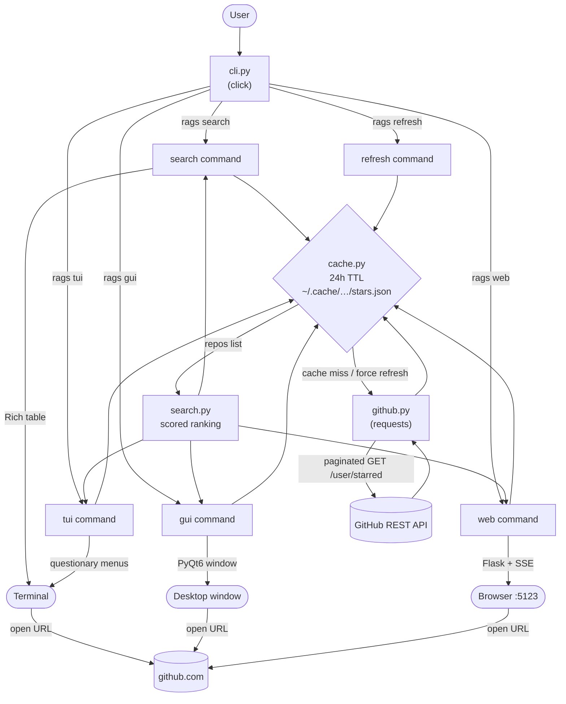

# rags-to-riches

Search your GitHub starred repositories — from the terminal, an interactive TUI, a native desktop window, or a local web app.

## CLI mode


A fast command-line interface for searching starred repos by name, description, topic, or language. Results are displayed in a colour-coded table and the top match can be opened directly in your browser.

## TUI mode



An interactive terminal experience driven entirely by arrow keys. Navigate a menu to search repos, browse by language, sort by stars/name/updated, view repo details, and open in browser — all without leaving the terminal.

## GUI mode



A native macOS window with live search, language filtering, sort controls, and one-click to open any repo in your browser. Fetches in the background with live progress in the status bar.

## Web mode


A local web app served at `http://localhost:5123`. Same features as the GUI — live search, language filter, sort by stars/name/updated, clickable column headers, and click any row to open the repo. Refresh streams live progress back to the page via SSE.

## Installation

```bash
uv venv .venv && uv pip install -e .
source .venv/bin/activate
```

## Auth

Set your GitHub token:

```bash
export GITHUB_TOKEN=ghp_...
```

Or install the [gh CLI](https://cli.github.com/) and run `gh auth login`.

## Usage

### TUI

```bash
rags tui                  # interactive terminal UI (arrow keys + search)
```

### GUI

```bash
rags gui                  # open the native GUI
```

### Web

```bash
rags web                  # open the web app (http://localhost:5123)
rags web --port 8080      # use a custom port
```

### CLI

```bash
rags search <query>       # search by name, description, topic, or language
rags search <query> -n 5  # limit results
rags search <query> -o    # open top result in browser
rags search <query> -r    # refresh cache before searching
rags refresh              # force refresh the local cache
```

Stars are cached at `~/.cache/rags-to-riches/stars.json` for 24 hours.

## Architecture



## Code

```
src/rags/
├── cli.py        Entry point for all commands (search, refresh, gui, web). Wires
│                 together the other modules and handles terminal output via Rich.
├── github.py     GitHub API client. Detects auth tokens (GITHUB_TOKEN env var or
│                 gh CLI), fetches starred repos with pagination, and accepts a
│                 callback to report progress per page.
├── cache.py      Reads and writes the local JSON cache at
│                 ~/.cache/rags-to-riches/stars.json with a 24-hour TTL.
├── search.py     Scores and ranks repos against a query string. Matches across
│                 name, full name, topics, description, and language — exact and
│                 prefix matches rank higher than substring matches.
├── gui.py        Native desktop window built with PyQt6. Runs the GitHub fetch in
│                 a background QThread so the UI stays responsive. Catppuccin Mocha
│                 colour scheme.
├── tui.py        Interactive terminal UI built with questionary and Rich. Arrow-key
│                 menus for searching, browsing by language, sorting, viewing repo
│                 details, and opening repos in the browser.
├── web.py        Flask web server. Exposes /api/repos (JSON) and /api/refresh
│                 (Server-Sent Events) so the browser receives live fetch progress
│                 without polling.
└── templates/
    └── index.html  Single-page web UI. All filtering and sorting runs client-side
                    in vanilla JS so results update instantly with no round trips.
```

## Libraries

| Library | Purpose |
|---|---|
| [click](https://click.palletsprojects.com) | CLI commands, options, and argument parsing |
| [requests](https://docs.python-requests.org) | HTTP calls to the GitHub REST API |
| [rich](https://github.com/Textualize/rich) | Coloured terminal output and tables for CLI mode |
| [PyQt6](https://www.riverbankcomputing.com/software/pyqt/) | Native desktop GUI and background threading |
| [Flask](https://flask.palletsprojects.com) | Web server and Server-Sent Events for the web mode |
| [questionary](https://github.com/tmbo/questionary) | Arrow-key menus and prompts for the TUI mode |
| [uv](https://github.com/astral-sh/uv) | Fast Python package and virtual environment management |
