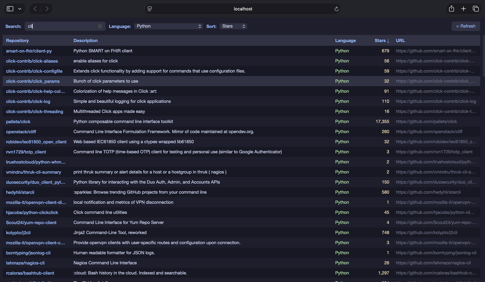

# rags-to-riches

A CLI for searching your GitHub starred repositories — with both a terminal and native GUI mode.

## CLI mode


## GUI mode


A native macOS window with live search, language filtering, sort controls, and one-click to open any repo in your browser. Fetches in the background with live progress in the status bar.

## Web mode



A local web app served at `http://localhost:5123`. Same features as the GUI — live search, language filter, sort by stars/name/updated, clickable column headers, and click any row to open the repo. Refresh streams live progress back to the page via SSE.

## Installation

```bash
uv venv .venv && uv pip install -e .
source .venv/bin/activate
```

## Auth

Set your GitHub token:

```bash
export GITHUB_TOKEN=ghp_...
```

Or install the [gh CLI](https://cli.github.com/) and run `gh auth login`.

## Usage

### GUI

```bash
rags gui                  # open the native GUI
```

### Web

```bash
rags web                  # open the web app (http://localhost:5123)
rags web --port 8080      # use a custom port
```

### CLI

```bash
rags search <query>       # search by name, description, topic, or language
rags search <query> -n 5  # limit results
rags search <query> -o    # open top result in browser
rags search <query> -r    # refresh cache before searching
rags refresh              # force refresh the local cache
```

Stars are cached at `~/.cache/rags-to-riches/stars.json` for 1 hour.
